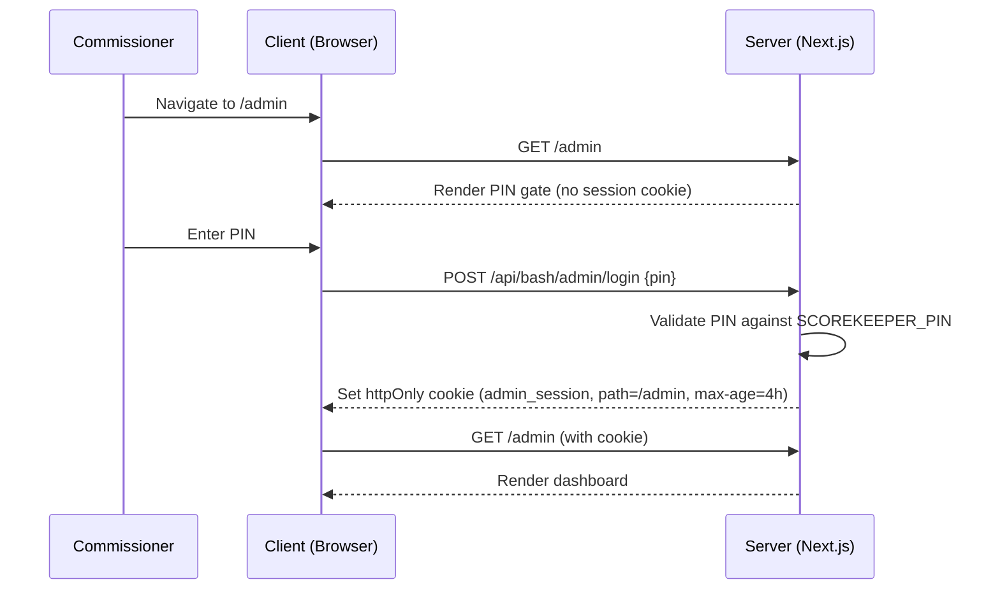

# PRD: Admin Phase 1 — Dashboard & Season Management

> **Status**: Draft
> **Author**: Chris Torres
> **Created**: 2026-04-18
> **Parent PRD**: [prd-admin-page.md](./prd-admin-page.md)

## 1. Overview

Phase 1 delivers the admin dashboard shell and season management features. This is the foundation that all future admin phases build on — auth, layout, navigation, and the highest-priority feature: managing season lifecycle from creation through completion.

### What's in scope
- Admin layout with PIN gate and session persistence
- Dashboard home with at-a-glance stats
- Full season CRUD with status lifecycle (draft → active → completed)
- Season creation wizard
- Placeholder panels for draft, registration, and schedule wizards
- Manual sync controls

### What's NOT in scope (deferred to Phase 2+)
- Player management / duplicate merging
- Team management
- Awards & Hall of Fame management
- Data quality dashboard

---

## 2. Architecture

### 2.1 Layout

Nested layout under `app/admin/` (Option B from parent PRD). The admin shell has its own sidebar navigation and does not use the public `SiteHeader`.

```
app/admin/
  layout.tsx              ← PIN gate + admin shell (sidebar, topbar)
  page.tsx                ← dashboard home
  seasons/
    page.tsx              ← season list
    [id]/
      page.tsx            ← season detail / edit
    new/
      page.tsx            ← season creation wizard
```

### 2.2 Auth Flow



**Session cookie spec**:
| Property | Value |
|---|---|
| Name | `admin_session` |
| Value | HMAC-signed token containing `{ authenticated: true, iat: timestamp }` |
| `httpOnly` | `true` |
| `secure` | `true` (production only) |
| `sameSite` | `lax` |
| `path` | `/admin` |
| `maxAge` | `14400` (4 hours) |

**New API routes**:
- `POST /api/bash/admin/login` — validates PIN, sets session cookie
- `POST /api/bash/admin/logout` — clears session cookie

**Server-side validation**: The `app/admin/layout.tsx` reads the cookie and validates the HMAC signature. If invalid or expired, it renders the PIN gate instead of `children`.

### 2.3 Database Changes

The `seasons` table needs a new `status` column:

```sql
ALTER TABLE seasons ADD COLUMN status text NOT NULL DEFAULT 'active';
```

**Drizzle schema update** (`lib/db/schema.ts`):
```typescript
export const seasons = pgTable("seasons", {
  id: text("id").primaryKey(),
  name: text("name").notNull(),
  leagueId: text("league_id"),  // optional — only needed when connecting to Sportability for sync
  isCurrent: boolean("is_current").notNull().default(false),
  seasonType: text("season_type").notNull().default("fall"),
  status: text("status").notNull().default("active"),  // NEW: draft | active | completed
})
```

**Status values**:
| Status | Description | Public visibility |
|---|---|---|
| `draft` | Season is being set up — not yet visible to public | ❌ Hidden |
| `active` | Season is live — games being played | ✅ Visible |
| `completed` | Season is over — archived, read-only | ✅ Visible |

**Migration strategy**: All existing seasons get `status = 'completed'` except the current season which gets `status = 'active'`. This can be done via a Drizzle migration or a one-time script.

### 2.4 Seasons Source-of-Truth Migration

Currently, seasons are **hardcoded** in `lib/seasons.ts` as a static `SEASONS` array with a hardcoded `CURRENT_SEASON_ID`. This is the source of truth for the public site.

For Phase 1, the admin will manage seasons in the **database** (`seasons` table). This creates a dual-source problem that needs to be addressed:

**Approach**: Keep `lib/seasons.ts` as the source of truth for Phase 1, but:
1. Admin season list reads from the database
2. Admin season creation inserts into the database AND appends to `lib/seasons.ts` (via API)
3. The `status` field lives only in the database — `lib/seasons.ts` doesn't need it since public pages already filter by `is_current` and `hasGames/hasStats`
4. Draft seasons (status = `draft`) are excluded from the public `SeasonSelector` by filtering on `status != 'draft'` server-side

> [!IMPORTANT]
> A full migration to database-only season config is recommended for Phase 2, removing the static `SEASONS` array entirely. Phase 1 keeps the dual approach to minimize blast radius.

---

## 3. Features

### 3.1 Admin Shell

**Sidebar navigation** (visible on all `/admin/*` pages):
- 🏠 Dashboard (`/admin`)
- 📅 Seasons (`/admin/seasons`)
- 🔄 Sync (action button, no page)
- 🔓 Logout (action button)

**Topbar**:
- "BASH Admin" branding
- Current season indicator
- Commissioner session status

**Design**: Desktop-first. Sidebar collapses to a hamburger on mobile. Dark-themed to visually differentiate from the public site.

### 3.2 Dashboard Home (`/admin`)

At-a-glance overview cards:

| Card | Data source | Content |
|---|---|---|
| Current Season | `seasons` WHERE `is_current` | Season name, type, status badge |
| Season Progress | `games` WHERE `season_id` | X of Y games completed, progress bar |
| Last Sync | `sync_metadata` WHERE `key = 'last_sync'` | Timestamp, "Sync Now" button |
| Players | `player_seasons` WHERE `season_id` | Player count for current season |

**Quick actions**:
- "Sync Now" button → triggers `POST /api/bash/sync`
- "New Season" button → navigates to `/admin/seasons/new`
- Link to current season detail

### 3.3 Season List (`/admin/seasons`)

**Table columns**:
| Column | Source |
|---|---|
| Name | `seasons.name` |
| Type | `seasons.season_type` (fall / summer) |
| Status | `seasons.status` (draft / active / completed) — color-coded badge |
| Teams | COUNT from `season_teams` |
| Games | COUNT from `games` |
| Players | COUNT from `player_seasons` |
| Actions | Edit, View on site (if not draft) |

**Filtering**: By status (draft / active / completed / all), by type (fall / summer)

**Sort**: Newest first (by season ID, which follows a chronological pattern)

### 3.4 Season Detail / Edit (`/admin/seasons/[id]`)

**Editable fields**:
- Season name
- Season type (fall / summer)
- Status (draft → active → completed) — one-way progression with confirmation
  - Transitioning draft → active **automatically sets `is_current = true`** on this season. Does NOT modify the previous season's `is_current` flag (multiple seasons can have `is_current = true` during a transition, but `getCurrentSeason()` should resolve to the newest active one).
- League ID (Sportability reference) — optional, can be added later when ready to sync

**Tabbed sections on the season detail page**:

#### Overview tab
- Season stats summary (games played, total goals, etc.)
- Quick status actions

#### Teams tab
- List of teams assigned to this season (from `season_teams`)
- Add/remove teams for draft seasons only

#### Roster tab
- Player assignments for this season (from `player_seasons`)
- Read-only for active/completed seasons

#### Schedule tab
- For active seasons: editable view of the current season schedule with the ability to make changes to scheduled games
- For completed seasons: read-only link to the public schedule page
- For draft seasons: placeholder card with description of upcoming schedule wizard:
  > **Schedule Wizard** (coming soon)
  > Define the full season schedule including regular season matchups and playoff dates. Configure time slots, bye weeks, and rivalry matchups.

#### Draft tab (placeholder for draft seasons only)
- Placeholder card:
  > **Draft Setup** (coming soon)
  > Configure the draft format: number of rounds, protection list sizes (2–10 per BASH rules), draft order based on previous season standings, and supplemental draft rules.

#### Registration tab (placeholder for draft seasons only)
- Placeholder card:
  > **Player Registration** (coming soon)
  > Manage player registration for the upcoming season. Track veteran returns, free agent declarations, rookie signups from pickups, and registration fee status.

### 3.5 Season Creation Wizard (`/admin/seasons/new`)

Multi-step wizard flow:

**Step 1: Basics**
- Season name (auto-suggested based on current date, e.g. "2026-2027" or "2026 Summer")
- Season type: Fall or Summer (radio buttons)
- League ID (optional — Sportability reference, can be added later)
- Status: Automatically set to `draft`

**Step 2: Teams**
- Select the count of teams to include in this season
- Option to select "unknown" if team count hasn't been decided yet

**Step 3: Confirmation**
- Review summary of season name, type, and team count
- "Create Season" button
- Inserts into `seasons` table (team assignments deferred to season detail page)
- Redirects to the new season's detail page

### 3.6 Manual Sync Controls

Accessible from the dashboard and as a sidebar action:
- "Sync Now" button triggers `POST /api/bash/sync`
- Show loading spinner during sync
- Display result (success with game count, or error message)
- Show last sync timestamp from `sync_metadata`

---

## 4. API Routes

All admin API routes validate the session cookie server-side.

| Method | Route | Description |
|---|---|---|
| `POST` | `/api/bash/admin/login` | Validate PIN, set session cookie |
| `POST` | `/api/bash/admin/logout` | Clear session cookie |
| `GET` | `/api/bash/admin/dashboard` | Dashboard stats (season, games, players, sync) |
| `GET` | `/api/bash/admin/seasons` | List all seasons with counts |
| `GET` | `/api/bash/admin/seasons/[id]` | Season detail with teams, player count |
| `PUT` | `/api/bash/admin/seasons/[id]` | Update season (name, type, status, is_current) |
| `POST` | `/api/bash/admin/seasons` | Create new season (with team assignments) |
| `POST` | `/api/bash/admin/seasons/[id]/teams` | Add team to season |
| `DELETE` | `/api/bash/admin/seasons/[id]/teams/[slug]` | Remove team from season |

---

## 5. Public Site Impact

### Season visibility
Draft seasons must be hidden from the public site. Changes needed:

1. **`SeasonSelector`** (`components/season-selector.tsx`): Filter out seasons where `status = 'draft'` — this is already partially handled since the selector only shows seasons with `hasGames || hasStats`, and draft seasons won't have any. However, an explicit `status` check is cleaner.

2. **`lib/seasons.ts`**: `getAllSeasons()` should exclude draft seasons from the public-facing list. Since the static array won't have a `status` field, draft seasons simply won't be added to the array until they transition to `active`.

3. **`getCurrentSeason()`**: Must never return a draft season. The `is_current` flag should only be set on an active season.

### Backwards compatibility
- All existing public pages continue to work unchanged
- The `SEASONS` array in `lib/seasons.ts` remains the public site's source of truth
- No existing API contracts change

---

## 6. File Inventory

### New files
| File | Purpose |
|---|---|
| `app/admin/layout.tsx` | Admin shell: PIN gate, sidebar, session validation |
| `app/admin/page.tsx` | Dashboard home |
| `app/admin/seasons/page.tsx` | Season list |
| `app/admin/seasons/[id]/page.tsx` | Season detail / edit |
| `app/admin/seasons/new/page.tsx` | Season creation wizard |
| `components/admin/admin-sidebar.tsx` | Sidebar navigation component |
| `components/admin/admin-topbar.tsx` | Admin top bar |
| `components/admin/dashboard-cards.tsx` | Dashboard stat cards |
| `components/admin/season-form.tsx` | Season edit form (shared between edit & create) |
| `components/admin/season-wizard.tsx` | Multi-step creation wizard |
| `components/admin/placeholder-card.tsx` | Reusable "coming soon" placeholder |
| `lib/admin-session.ts` | Session cookie helpers (sign, verify, set, clear) |
| `app/api/bash/admin/login/route.ts` | Login endpoint |
| `app/api/bash/admin/logout/route.ts` | Logout endpoint |
| `app/api/bash/admin/dashboard/route.ts` | Dashboard data endpoint |
| `app/api/bash/admin/seasons/route.ts` | Season list + create |
| `app/api/bash/admin/seasons/[id]/route.ts` | Season detail + update |
| `app/api/bash/admin/seasons/[id]/teams/route.ts` | Manage season team assignments |

### Modified files
| File | Change |
|---|---|
| `lib/db/schema.ts` | Add `status` column to `seasons` table |
| `components/season-selector.tsx` | Filter out draft seasons (belt-and-suspenders) |

---

## 7. Open Questions (All Resolved)

- [x] ~~Should the wizard allow setting league_id?~~ **Resolved: Yes, as optional.** League ID is an optional field in both the wizard and the season edit form. Commissioners can add it later when they're ready to connect to Sportability for syncing.
- [x] ~~Should draft → active auto-set `is_current`?~~ **Resolved: Yes, automatically.** Transitioning a season from draft → active automatically sets `is_current = true` on that season. The previous season's flag is **not** modified — `getCurrentSeason()` should resolve to the newest active season.
- [x] ~~Session signing secret?~~ **Resolved: Reuse `SCOREKEEPER_PIN`.** Both admin and scorekeeper already share the same `SCOREKEEPER_PIN` env var (confirmed in `validate-pin/route.ts` and all scorekeeper routes). No new env var needed — use `SCOREKEEPER_PIN` as the HMAC signing key for the session cookie.

---

## 8. Verification Plan

### Automated
- Admin layout renders PIN gate when no session cookie
- PIN login sets cookie and grants access
- Season CRUD: create, list, edit, status transitions
- Draft seasons hidden from public `SeasonSelector`
- Session expires after 4 hours

### Manual
- Walk through full season creation wizard flow
- Verify admin shell looks visually distinct from public site
- Test on mobile: sidebar collapses, dashboard cards stack
- Confirm existing public site pages are unaffected
