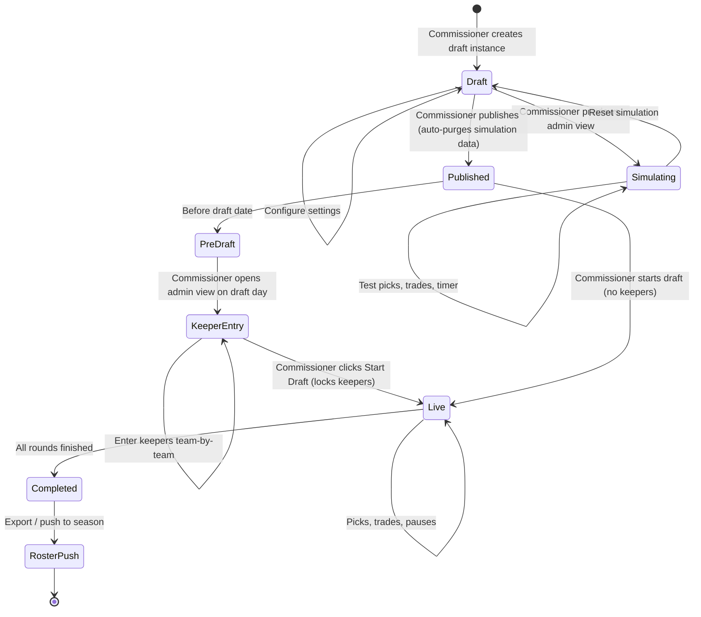
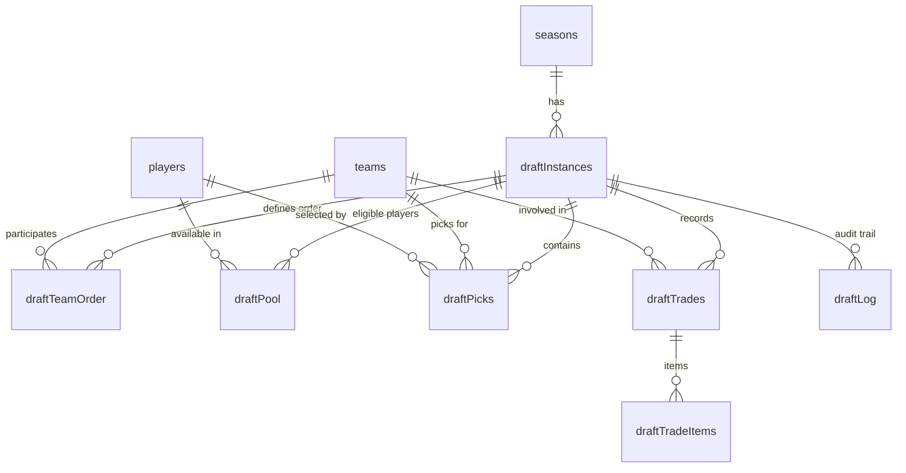

# PRD: Draft Wizard & Live Draft Board

> **Status**: Draft
> **Author**: Chris Torres
> **Created**: 2026-05-04
> **Parent PRD**: [prd-admin-page.md](./prd-admin-page.md)

## 1. Overview

### Description

A dedicated, interactive draft system for managing the BASH league draft process. This replaces the current spreadsheet-based drafting system with three distinct components:

1. **Draft Setup Wizard** (Admin) — Create, configure, and stage an upcoming draft instance
2. **Admin Presentation View** (Admin) — Live draft controls including pick entry, trades, timer management, and draft order editing
3. **Public Presentation View** (Public) — A read-only live board at a public URL for captains, players, and fans to follow in real-time on desktop or mobile

### Primary Users

| Role | Access | Description |
|---|---|---|
| **Commissioner** | Admin (PIN auth) | Sets up the draft, controls the live board, enters picks, manages trades and timing |
| **Public** | Read-only (public URL) | Captains, players, and fans — everyone sees the same live read-only presentation |

> [!NOTE]
> Captains do **not** have a separate interactive role. The Commissioner enters all picks on behalf of captains as final confirmation. Captains view the same public presentation as everyone else.

### Core Goals

- Provide a draft creation wizard for commissioners to configure and stage drafts in advance
- Deliver a presentation view at a public link that works well on both desktop and mobile
- Build an admin presentation view with live draft management capabilities (pick entry, trades, timer, draft order editing)
- Automatically generate league rosters upon draft completion

---

## 2. User Stories

- **User Story 1 (Commissioner — Setup)**: As the Commissioner, I want to create and configure a draft instance in advance — setting the number of rounds, participating teams with their captains for the upcoming season, draft order, draft date, location, and timer settings — so that draft day runs smoothly without manual data entry.

- **User Story 2 (Commissioner — Preview)**: As the Commissioner, I want to preview the admin presentation view and simulate a mock draft while the instance is still staged — making test picks, testing trades, and verifying the timer — so I can confirm everything works before publishing to the public.

- **User Story 3 (Commissioner — Live)**: As the Commissioner, I want to manage the live draft from an admin view, including entering picks on behalf of captains, executing pick swaps and player trades mid-draft, pausing/resuming the timer, editing draft order, and reverting picks — so the digital board perfectly reflects the real-world draft happening in the room.

- **User Story 4 (Public — Pre-Draft)**: As a player or fan, I want to visit the draft page before draft day and see the scheduled date, time, and location — so I know when and where to show up or tune in.

- **User Story 5 (Public — Live)**: As a player or fan, I want to follow a read-only live link to the Draft Board and see picks being made in real-time, including which team is on the clock and what teams have selected — so I can follow along from home or on my phone.

---

## 3. Functional Requirements

### Must Have (P0)

- **Draft Setup Wizard**: Admin tool to create a draft instance via a 5-step wizard:
  - Draft settings (name, date, time, location, pick timer, draft format, number of rounds, max keepers per team)
  - Eligible player pool import (from registration data, CSV, or manual entry)
  - Participating teams, captains, and franchise assignment
  - Draft order and pre-draft trades
  - Review and create

- **Player Pool Import**: The player pool defines the universe of eligible players for the draft. Importing the pool early (Step 2) ensures the captain selection, keeper entry, and live pick search all draw from the same validated list.
  - Use the current player list from the database (currently 164 players) as the base pool
  - Import Sportability Roster from CSV (reuses the same import functionality as the admin Players tab)
  - Manual entry (add individual players)
  - The pool can be edited after creation on the draft management page

- **Team & Captain Configuration**: The commissioner defines participating teams and designates captains during draft setup (Step 3). Teams may optionally be configured in advance via the admin **Teams tab** (under season management), but this is not a hard prerequisite — the draft wizard supports full team setup as well:
  - **Pre-populated from admin**: If teams have already been added to the season via the admin Teams tab, they are pre-populated in Step 3 of the wizard. The commissioner can review, edit team names, and add/edit captains.
  - **Add from franchise**: Select an existing franchise (e.g., "Red", "Blue") to add a team. The wizard shows the franchise's previous season team name and captains as defaults, editable by the commissioner.
  - **New team/franchise**: Create a new team name (and optionally a new franchise) and designate captains — either by selecting existing players from the pool (imported in Step 2) or entering new player names (which creates new player records)
  - **Captain designation**: 1–2 captains per team, selected by searching the imported player pool or entering new names
  - Captains are written to `player_seasons` with `isCaptain: true` for the new season when the draft instance is created
  - Captain designations are editable on the draft management page until the draft transitions to `live`

- **Draft Order & Pre-Draft Trades** (Step 4): After teams are defined, the commissioner sets the pick order and configures any trades that were agreed upon before the draft:
  - **Draft order**: Drag teams to set pick order (first pick → last pick). Per BASH Rule 204, last-place team picks first, champion picks last — but this is manually set for now (auto-calculation from standings is P2).
  - **Pre-draft trades**: Configure pick swaps agreed upon before draft day (e.g., Team A trades their Round 3 pick to Team B for Team B's Round 5 pick). These are recorded in the `draftTrades` table and reflected on the board from the start.

- **Keeper Lists (Draft-Day Entry)**: Keepers are entered in the admin presentation view on draft day — not during setup — because keeper decisions are typically finalized only hours before the draft starts. Each team can designate up to the configured max keepers (set in Step 1, default 8) from the previous season's roster, pre-slotted into specific draft rounds:
  - The admin presentation view opens in a **"Pre-Draft: Enter Keepers"** phase before the commissioner starts the draft
  - Commissioner selects keepers team-by-team and assigns each to a round
  - By default, keepers fill rounds sequentially starting from Round 1 (e.g., 4 keepers → Rounds 1–4)
  - The commissioner can override any keeper's round assignment (e.g., a keeper slotted into Round 12 instead of the default)
  - The board live-previews pre-filled keeper picks as they are entered
  - When the commissioner clicks **"Start Draft"**, keeper picks are locked and the draft begins — skipping any keeper-occupied picks automatically
  - When the draft reaches a round/pick occupied by a keeper, that pick is **auto-confirmed** with the kept player — no timer needed, the draft advances immediately
  - The board visually distinguishes keeper picks from live draft picks (e.g., a "K" badge or distinct color)
  - **Captain enforcement**: Players designated as captains for the upcoming season (set during draft setup, Step 3) are auto-suggested as keepers and a validation warning is shown if a team's captain(s) are not included in the keeper list. Captains must be kept per BASH Rule 203.
  - Example: Team A keeps 4 players → picks 1–4 are pre-filled. Team B keeps 3 players but one is slotted in Round 12 → picks 1, 2, and 12 are pre-filled

- **Draft Instance Lifecycle**: A draft instance progresses through these states:
  - `draft` — Visible only to admins for configuration and simulation/preview
  - `published` — Visible at a public URL for captains, players, and fans

- **Simulation / Preview Mode**: While in the `draft` state, the commissioner can open the admin presentation view and run a full simulated draft:
  - All admin controls are functional: pick entry, trades, timer, order editing, undo
  - A prominent **"SIMULATION MODE"** banner is displayed across the top to prevent confusion with a real draft
  - Simulation picks and trades are stored in the database with a `isSimulation: true` flag so they can be cleanly separated
  - **"Reset Simulation"** button clears all simulation picks, trades, and log entries with a single click, returning the draft to a clean pre-start state
  - Simulation can be run multiple times — reset and re-simulate as needed
  - When the commissioner publishes the draft, any remaining simulation data is automatically purged
  - **Public view preview**: A preview link to the public presentation view is available during simulation, but requires admin authentication (scorekeeper PIN). This lets the commissioner verify exactly what viewers will see on draft day — board layout, franchise colors, timer, responsive behavior — without making the page publicly accessible. The preview URL follows the same pattern as the public link (e.g., `/draft/[id]?preview=true`) and shows a subtle "PREVIEW — NOT PUBLIC" badge.

- **Live Draft Board (Public)**: A real-time presentation view displaying:
  - The draft grid/board showing all teams and their picks. Traded picks display the franchise color of the team that now owns the pick, making trade activity immediately visible on the board.
  - Which team is currently on the clock, plus the next 3 teams on deck with upcoming picks
  - Full history of picks as they happen
  - Which team made each pick (team name and branding)
  - Pick timer countdown
  - Works well on desktop and mobile

- **Commissioner Controls (Admin Presentation View)**: The admin view includes all public presentation content plus:
  - **Pick Entry**: Select a player for the current team with a confirmation window (5-second revert ability before finalizing)
  - **Pick Swap**: Swap draft picks between teams (e.g., Team A's Round 2 Pick 4 for Team B's Round 3 Pick 1)
  - **Player Trades**: Move a player already drafted from one team to another
  - **Timer Controls**: Pause/resume the pick timer at any time; adjust the timer duration mid-draft
  - **Draft Order Editing**: Modify the draft order during the draft
  - **Navigate to Previous Pick**: Return to any previous pick and edit it at any time
  - **Undo Last Pick**: Quick undo without corrupting draft order

- **Draft Timer**: Visual countdown clock for the current pick. When time expires, a **visual indicator** (flash/pulse on the board) signals that time is up — no audible buzzer. Since the board is presented to all viewers, everyone sees the visual signal simultaneously.

- **Post-Draft**:
  - **Roster Export**: Export the full draft results as a list of player names and team assignments (CSV/clipboard)
  - **Roster Push**: One-click sync of draft results to populate the active season's official rosters in the database (`player_seasons` + `season_teams`)

### Should Have (P1)

- **Pick Trades Management**: Detailed UI for complex multi-pick trades with trade history log
- **Live Updates**: The public board auto-refreshes for all viewers using the same SWR polling pattern as the existing live scorekeep tool (`useLiveGame` hook — 10-second `refreshInterval` with `revalidateOnFocus`). A dedicated `/api/bash/draft/[id]/live` endpoint serves the current board state as optimized JSON.

### Could Have (P2)

- **Auto Draft Order Calculation**: Automatically compute draft order from previous season standings per BASH Rule 204
- **Draft History Page**: Public page showing historical draft results by season
- **Supplemental Draft Mode**: Separate draft instance type for mid-season supplemental drafts (BASH Rule 206)

---

## 4. UI/UX & Information Architecture

### Pages & Components

#### Draft Setup Wizard (`/admin/seasons/[id]/draft/new`)

Step-by-step admin form to configure the draft instance:

| Step | Name | Description |
|---|---|---|
| 1 | **Settings** | Draft name, date, time, location, pick timer duration (default 2 minutes), draft format (Snake or Linear), number of rounds, max keepers per team (default 8) |
| 2 | **Player Pool** | Import eligible players via Sportability Roster CSV import (preferred), manual entry, or registration period (when built). Defines the universe of draftable players and captain candidates. |
| 3 | **Teams & Captains** | Pre-populated with teams from the admin Teams tab (if any). Add teams by selecting an existing franchise or creating a new one. Edit team names, add/remove teams, and designate 1–2 captains per team from the imported player pool. |
| 4 | **Draft Order & Pre-Draft Trades** | Set team pick order (drag to reorder). Configure any pre-draft pick swaps agreed upon before draft day. |
| 5 | **Review & Create** | Summary of all settings. "Create as Draft" (admin-only) or "Create & Publish" (goes live immediately) |

#### Admin Presentation View (`/admin/seasons/[id]/draft/live`)

The Commissioner's command center during **simulation** (draft state), **keeper entry** (pre-draft on draft day), and **live** drafts. The view has two phases:

**Phase 1 — Pre-Draft: Enter Keepers** (shown before the draft starts):
- The Big Board is visible but empty (or showing simulation data if in draft state)
- **Keeper Entry Panel** replaces the pick controls:
  - Team selector dropdown — pick which team to configure
  - Player search within the eligible pool for that team
  - For each keeper: assign to a round (defaults to next sequential round, draggable to any open round)
  - Running summary: "Team A: 4 keepers (R1–R4) | Team B: 3 keepers (R1, R2, R12) | Team C: 0 keepers"
  - Board live-previews keeper picks as they're entered (shown with "K" badge)
- **"Start Draft"** button — locks all keeper picks and begins Round 1 (requires confirmation dialog)
- Keeper entry is optional — if no keepers are entered, the commissioner can start the draft immediately

**Phase 2 — Live Draft** (after "Start Draft" is clicked):
- **The Big Board** — Full draft grid identical to the public view (high-contrast, TV-friendly), with keeper picks pre-filled and badged
  - Each team's column header uses the **franchise color** as a background tint (pulled from `franchises.color` via `season_teams.franchiseSlug`)
  - Pick cards for each team use a subtle franchise color accent (border or background wash)
  - The **"on the clock"** team's column pulses or glows with an intensified version of the franchise color
- **Control Panel** (sidebar or bottom bar):
  - Current pick info: Team name, round, pick number
  - Player search/filter with quick-select
  - Pick confirmation dialog (5-second revert countdown)
  - Timer display with Pause / Resume / Adjust buttons
  - "Trade" button → opens trade modal
  - "Edit Order" button → opens order editor
  - "Go to Pick #..." → navigate to any previous pick for editing
- **Trade Modal**: Two-pane interface for pick swaps and player trades
  - Left: Team A picks/players
  - Right: Team B picks/players
  - Drag or select items to swap, confirm trade
- **Draft Log**: Scrolling activity feed of all picks, trades, and undos with timestamps

**Simulation Controls** (visible only in `draft` state, available in both phases):
- **"SIMULATION MODE"** banner across the top of the view
- **"Reset Simulation"** button — clears all test picks/trades/keepers, resets board to clean state
- **"Exit Preview"** button — returns to the draft setup/management page

#### Public Presentation View (`/draft/[season]`)

A dedicated public page accessible via a shareable, season-based URL (e.g., `/draft/2026-2027`).

**Before draft day** (draft is `published` but not started):
- Displays draft date, time, and location
- "Draft starts in X days / hours" countdown
- Season name and participating teams

**During the draft** (live):
- **The Big Board** — Real-time grid of all teams and their picks
  - Team columns/rows are tinted with franchise colors for instant visual identification
  - The "on the clock" team's section pulses with an intensified franchise color glow
- Current team "on the clock" with visual highlight and timer
- Pick-by-pick ticker showing most recent selections with team attribution
- Responsive layout: grid view on desktop, stacked card view on mobile
- **Presentation mode**: A toggle that maximizes the board into a fullscreen, chrome-free layout optimized for casting to a TV at the draft party (hides nav, footer, and non-essential UI)
- **Visual timer expiry signal** — board flashes/pulses when time runs out

**After the draft** (completed):
- Final board showing all picks by team and round
- Link to the season roster page

### User Workflows



### Draft Instance States

| State | Admin Visibility | Public Visibility | Description |
|---|---|---|---|
| `draft` | ✅ Full access + simulation | ❌ Hidden | Being configured and tested by commissioner. Admin can preview the full presentation view and run simulated drafts. |
| `published` | ✅ Full access | ✅ Pre-draft info only | Public page shows date/time/location countdown. All simulation data has been purged. |
| `live` | ✅ Admin controls | ✅ Real-time board | Draft is actively in progress |
| `paused` | ✅ Admin controls | ✅ Board visible (paused) | Commissioner has paused the draft |
| `completed` | ✅ Results + export | ✅ Final board | All rounds finished, results available |

---

## 5. Technical Architecture & Data Models

### Schema Changes to Existing Tables

```typescript
// ─── franchises (new table) ─────────────────────────────────────────────────

// Represents a persistent franchise identity across seasons. In BASH, franchises
// are typically identified by their color (e.g., the "red" franchise has been
// Cherry Bombs, Red Army, No Regretzkys across different seasons).
// Franchise color is used for draft board theming, team pages, and standings accents.

export const franchises = pgTable("franchises", {
  slug: text("slug").primaryKey(),                   // e.g. "red", "blue", "black"
  name: text("name").notNull(),                      // e.g. "Red Franchise"
  color: text("color"),                              // hex color e.g. "#DC2626"
})

// ─── season_teams (existing table — add franchiseSlug) ──────────────────────

// Migration: ALTER TABLE season_teams ADD COLUMN franchise_slug text REFERENCES franchises(slug);
//
// Links a season-specific team to its franchise for cross-season stat aggregation
// and consistent color theming. Optional FK — not all historical teams may be mapped.

export const seasonTeams = pgTable(
  "season_teams",
  {
    // ... existing fields (seasonId, teamSlug) ...
    franchiseSlug: text("franchise_slug")              // NEW
      .references(() => franchises.slug),
  },
)

// ─── player_seasons (existing table — add isCaptain) ────────────────────────

// Migration: ALTER TABLE player_seasons ADD COLUMN is_captain boolean NOT NULL DEFAULT false;
//
// Designates 1–2 players per team per season as team captains (BASH Rule 102).
// Set during draft setup (Step 2: Teams & Captains) for the upcoming season.
// Used by the draft keeper entry phase to auto-suggest and validate that
// captains are included in each team's keeper list (BASH Rule 203).

export const playerSeasons = pgTable(
  "player_seasons",
  {
    // ... existing fields (playerId, seasonId, teamSlug, isGoalie) ...
    isCaptain: boolean("is_captain").notNull().default(false),  // NEW
  },
)
```

### New Draft Tables (Drizzle schema additions to `lib/db/schema.ts`)

```typescript
// ─── Draft Instances ────────────────────────────────────────────────────────

export const draftInstances = pgTable("draft_instances", {
  id: text("id").primaryKey(),                       // gen-[UUID]
  seasonId: text("season_id")
    .notNull()
    .references(() => seasons.id),
  name: text("name").notNull(),                      // e.g. "2026-2027 BASH Draft"
  status: text("status").notNull().default("draft"), // draft | published | live | paused | completed
  isSimulating: boolean("is_simulating").notNull().default(false), // true when admin is running a simulation
  draftType: text("draft_type").notNull().default("snake"), // snake | linear
  rounds: integer("rounds").notNull().default(14),
  timerSeconds: integer("timer_seconds").notNull().default(120), // default pick timer
  maxKeepers: integer("max_keepers").notNull().default(8),        // max keepers per team
  draftDate: timestamp("draft_date", { withTimezone: true }),
  location: text("location"),                        // e.g. "The Connecticut Yankee"
  currentRound: integer("current_round"),
  currentPick: integer("current_pick"),
  createdAt: timestamp("created_at", { withTimezone: true }).defaultNow(),
  updatedAt: timestamp("updated_at", { withTimezone: true }).defaultNow(),
})

// ─── Draft Team Order ───────────────────────────────────────────────────────

export const draftTeamOrder = pgTable(
  "draft_team_order",
  {
    draftId: text("draft_id")
      .notNull()
      .references(() => draftInstances.id, { onDelete: "cascade" }),
    teamSlug: text("team_slug")
      .notNull()
      .references(() => teams.slug),
    position: integer("position").notNull(),          // 1-indexed order
  },
  (t) => [
    primaryKey({ columns: [t.draftId, t.teamSlug] }),
    index("idx_draft_team_order").on(t.draftId, t.position),
  ]
)

// ─── Draft Pool (Eligible Players) ──────────────────────────────────────────

export const draftPool = pgTable(
  "draft_pool",
  {
    draftId: text("draft_id")
      .notNull()
      .references(() => draftInstances.id, { onDelete: "cascade" }),
    playerId: integer("player_id")
      .notNull()
      .references(() => players.id),
    isKeeper: boolean("is_keeper").notNull().default(false),
    keeperTeamSlug: text("keeper_team_slug")         // team keeping this player
      .references(() => teams.slug),
    keeperRound: integer("keeper_round"),             // round they're slotted into (e.g., 1, 2, 12)
  },
  (t) => [
    primaryKey({ columns: [t.draftId, t.playerId] }),
  ]
)

// ─── Draft Picks ────────────────────────────────────────────────────────────

export const draftPicks = pgTable(
  "draft_picks",
  {
    id: text("id").primaryKey(),                      // gen-[UUID]
    draftId: text("draft_id")
      .notNull()
      .references(() => draftInstances.id, { onDelete: "cascade" }),
    round: integer("round").notNull(),
    pickNumber: integer("pick_number").notNull(),     // overall pick # (1, 2, 3...)
    teamSlug: text("team_slug")                       // team making the pick (may differ from original due to trades)
      .notNull()
      .references(() => teams.slug),
    originalTeamSlug: text("original_team_slug")      // original team before any trades
      .notNull()
      .references(() => teams.slug),
    playerId: integer("player_id")                    // null until pick is made
      .references(() => players.id),
    pickedAt: timestamp("picked_at", { withTimezone: true }),
    isKeeper: boolean("is_keeper").notNull().default(false),      // true for auto-confirmed keeper picks
    isSimulation: boolean("is_simulation").notNull().default(false), // true for simulation picks (purged on publish)
  },
  (t) => [
    index("idx_draft_picks_draft").on(t.draftId),
    index("idx_draft_picks_team").on(t.draftId, t.teamSlug),
  ]
)

// ─── Draft Trades ───────────────────────────────────────────────────────────

export const draftTrades = pgTable("draft_trades", {
  id: text("id").primaryKey(),                        // gen-[UUID]
  draftId: text("draft_id")
    .notNull()
    .references(() => draftInstances.id, { onDelete: "cascade" }),
  teamASlug: text("team_a_slug")
    .notNull()
    .references(() => teams.slug),
  teamBSlug: text("team_b_slug")
    .notNull()
    .references(() => teams.slug),
  tradeType: text("trade_type").notNull(),            // pick_swap | player_trade
  description: text("description"),                   // human-readable summary
  tradedAt: timestamp("traded_at", { withTimezone: true }).defaultNow(),
  isSimulation: boolean("is_simulation").notNull().default(false), // true for simulation trades (purged on publish)
})

// ─── Draft Trade Items (what was exchanged) ─────────────────────────────────

export const draftTradeItems = pgTable(
  "draft_trade_items",
  {
    id: serial("id").primaryKey(),
    tradeId: text("trade_id")
      .notNull()
      .references(() => draftTrades.id, { onDelete: "cascade" }),
    fromTeamSlug: text("from_team_slug")
      .notNull()
      .references(() => teams.slug),
    toTeamSlug: text("to_team_slug")
      .notNull()
      .references(() => teams.slug),
    pickId: text("pick_id")                           // for pick swaps
      .references(() => draftPicks.id),
    playerId: integer("player_id")                    // for player trades
      .references(() => players.id),
  }
)

// ─── Draft Activity Log ─────────────────────────────────────────────────────

export const draftLog = pgTable("draft_log", {
  id: serial("id").primaryKey(),
  draftId: text("draft_id")
    .notNull()
    .references(() => draftInstances.id, { onDelete: "cascade" }),
  action: text("action").notNull(),                   // pick | trade | undo | pause | resume | order_change | timer_change
  detail: jsonb("detail"),                            // action-specific payload
  isSimulation: boolean("is_simulation").notNull().default(false), // true for simulation log entries (purged on publish)
  createdAt: timestamp("created_at", { withTimezone: true }).defaultNow(),
})
```

#### ER Diagram



### APIs / Endpoints

| Method | Route | Auth | Description |
|---|---|---|---|
| `POST` | `/api/bash/admin/draft` | Admin | Create a new draft instance |
| `GET` | `/api/bash/admin/draft/[id]` | Admin | Get draft instance with full state |
| `PUT` | `/api/bash/admin/draft/[id]` | Admin | Update draft settings |
| `POST` | `/api/bash/admin/draft/[id]/simulate` | Admin | Enter simulation mode (opens admin presentation view in draft state) |
| `POST` | `/api/bash/admin/draft/[id]/reset-simulation` | Admin | Clear all simulation picks, trades, and logs |
| `POST` | `/api/bash/admin/draft/[id]/publish` | Admin | Transition draft → published (auto-purges simulation data) |
| `POST` | `/api/bash/admin/draft/[id]/start` | Admin | Transition published → live |
| `POST` | `/api/bash/admin/draft/[id]/pause` | Admin | Toggle pause/resume |
| `POST` | `/api/bash/admin/draft/[id]/complete` | Admin | Mark draft as completed |
| `PUT` | `/api/bash/admin/draft/[id]/order` | Admin | Update team draft order |
| `PUT` | `/api/bash/admin/draft/[id]/timer` | Admin | Adjust timer duration |
| `POST` | `/api/bash/admin/draft/[id]/pick` | Admin | Submit a pick (with 5s revert window) |
| `POST` | `/api/bash/admin/draft/[id]/undo` | Admin | Undo the last pick |
| `PUT` | `/api/bash/admin/draft/[id]/pick/[pickId]` | Admin | Edit a previous pick |
| `POST` | `/api/bash/admin/draft/[id]/trade` | Admin | Execute a pick swap or player trade |
| `GET` | `/api/bash/admin/draft/[id]/export` | Admin | Export draft results (CSV) |
| `POST` | `/api/bash/admin/draft/[id]/push-rosters` | Admin | Push results to season rosters |
| `GET` | `/api/bash/draft/[season]` | Public | Get public draft state (board, picks, timer) — resolves season slug to draft instance internally |
| `GET` | `/api/bash/draft/[season]/poll` | Public | Lightweight polling endpoint (current state hash + latest picks) |

### Real-Time Strategy

For MVP, use **aggressive short-polling** (3-5 second interval) on the `/api/bash/draft/[id]/poll` endpoint. This endpoint returns a minimal payload:

```typescript
{
  stateHash: string,      // changes on any mutation — client skips re-render if unchanged
  status: string,          // live | paused | completed
  currentRound: number,
  currentPick: number,
  timerRemaining: number,  // seconds
  latestPicks: DraftPick[] // last 5 picks for the ticker
}
```

If the `stateHash` hasn't changed, the client does nothing. If it has, the client fetches the full board state. This keeps bandwidth minimal while maintaining near-real-time feel.

> [!NOTE]
> WebSocket upgrade path: If polling proves insufficient at scale (many concurrent viewers), the same API contract can back a WebSocket implementation later. The `stateHash` diffing pattern works identically over either transport.

### Integrations

- **Registration**: The draft pool can be auto-populated from a completed registration period's paid registrants. Rookies in `registered_unpaid` status are also eligible for the pool.
- **Season Rosters**: Post-draft roster push creates `player_seasons` entries linking each drafted player to their team for the active season.
- **Standings**: Draft order for P2 can be auto-computed from previous season standings via `computeStandings()`.

---

## 6. Layout & Routing

```
app/
  admin/
    seasons/
      [id]/
        draft/
          page.tsx              ← Draft management (setup / status)
          new/
            page.tsx            ← Draft creation wizard (5 steps)
          live/
            page.tsx            ← Admin presentation view (live controls)
  draft/
    [season]/
      page.tsx                  ← Public presentation view (read-only, season-based URL)
```

---

## 7. Edge Cases & Constraints

| Scenario | Handling |
|---|---|
| **Uneven teams** | Some teams may have more/fewer picks due to keeper counts or trades. The grid handles irregular row counts per team. |
| **Pick revert** | After selecting a player, a 5-second confirmation countdown allows the commissioner to cancel. After 5s, the pick is final (but can still be edited via "Go to Pick #"). |
| **Mid-draft trades** | Pick swaps update `draftPicks.teamSlug` for the affected picks. Player trades update the player's team assignment and are logged in `draftTrades`. |
| **Commissioner misclick** | "Undo Last Pick" button immediately available. For older picks, "Go to Pick #" navigates back to edit. |
| **Browser disconnect** | Admin presentation view auto-reconnects. Draft state is fully server-side — reconnecting resumes exactly where it was. |
| **Mobile viewers** | Public view uses responsive design: card-based layout on mobile, grid on desktop. Timer and "on the clock" team are always above the fold. |
| **Draft with keepers** | Keeper players are pre-slotted into their designated rounds (default: sequential from R1, or commissioner-assigned). When the draft reaches a keeper pick, it is auto-confirmed with no timer. The board shows a "K" badge on keeper picks. |
| **Keeper in late round** | A keeper slotted into Round 12 means that team's Round 12 pick is pre-filled. All other rounds for that team proceed as normal draft picks. The grid correctly shows the gap (e.g., Rounds 3–11 are open picks, Round 12 is a keeper). |
| **Keeper count varies by team** | Teams may have 1–8 keepers. The board and draft order engine handle asymmetric keeper counts gracefully — teams with fewer keepers simply have more open picks in early rounds. |
| **Captain not kept** | If a team's captain(s) for the upcoming season (designated during draft setup Step 2) are not included in the keeper list, a validation warning is shown: "Team A's captain(s) [Name] are not in the keeper list. Captains must be kept per BASH rules. Continue anyway?" The commissioner can override (in case the captain declared free agency or other special circumstances). |
| **No registration module yet** | Draft pool can be populated manually (CSV upload or admin entry) without requiring the registration module to be built first. |
| **Simulation data leaking** | All simulation picks/trades are tagged with `isSimulation: true`. Publishing auto-deletes all rows where `isSimulation = true`. Reset button does the same. No simulation data ever appears on the public view. |
| **Accidental publish during simulation** | Publishing requires an `AlertDialog` confirmation ("This will clear all simulation data and make the draft page public. Continue?"). |

---

## 8. BASH Rulebook Integration

The following BASH rules (Rulebook 2019) directly inform draft wizard behavior:

| Rule | Enforcement | Implementation |
|---|---|---|
| **Rule 102: Captains** | 1–2 captains per team, must be designated on keeper/protected list | `player_seasons.isCaptain` field; designated during draft setup (Step 2: Teams & Captains) for the upcoming season, auto-suggested as keepers during pre-draft entry with validation warning if omitted |
| **Rule 203: Keeper / Protected Lists** | 1–8 keepers per team, captains in rounds 1–2 | `draftPool.isKeeper`, `keeperRound` fields; keeper entry in admin presentation view (pre-draft phase) with per-player round assignment |
| **Rule 204: Draft Order** | Last place picks first, champion last | P2: auto-calculation from standings. P0: manual ordering |
| **Rule 204: Preliminary vs Regular Rounds** | Until equal roster sizes, then fill to 14 | Draft rounds handle variable team picks via the keeper slotting system |
| **Rule 202: Pickup Eligibility** | Must attend ≥1 pickup | Not enforced by software; commissioner's discretion |

---

## 9. Implementation Phases

### Phase A — Draft Setup & Data Model (recommended first PR)
- Database schema migration: create `franchises` table, add `franchise_slug` to `season_teams`, add `is_captain` to `player_seasons`, create all new draft tables
- Franchise seed data (map existing teams to franchises with colors)
- Draft creation wizard (5-step form)
- Draft instance CRUD (create, edit, delete)
- Draft pool management (manual player entry + CSV import)
- Draft state machine (draft → published) with simulation support
- Simulation mode: preview admin presentation view, make test picks, reset
- Replace admin Draft tab placeholder with real draft management

### Phase B — Live Draft Board
- Admin presentation view with pick entry + confirmation
- Pre-draft keeper entry phase (team-by-team, round assignment, board preview)
- Public presentation view (read-only)
- Pick timer with visual expiry signal
- Short-polling for real-time updates
- Undo last pick
- Navigate to / edit previous picks
- Pause / resume controls

### Phase C — Trades & Export
- Pick swap functionality
- Player trade functionality
- Trade history log
- Draft activity log (audit trail)
- CSV export of results
- Roster push to `player_seasons` / `season_teams`

### Phase D — Advanced (P2)
- Auto draft order from standings
- Draft history public page
- Supplemental draft mode
- WebSocket upgrade (if needed)

---

## 10. Resolved Questions

- [x] **Timer default**: 2 minutes per pick. Single timer selector in Step 1 — does not vary by round.
- [x] **Player pool source**: Sportability Roster CSV import is preferred when no registration period exists. Manual entry also supported.
- [x] **Public URL structure**: Season-based URLs (e.g., `/draft/2026-2027`).
- [x] **TV casting**: Presentation mode toggle on the public view — fullscreen, chrome-free layout for TV casting.
- [x] **Draft day logistics**: WiFi available at draft location. Standard 10-second SWR polling is sufficient.
